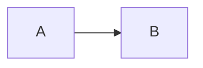

# Chapter 12 — Mermaid Diagrams

Documentation isn't just about text.

Sometimes a diagram explains an idea better than several paragraphs.

GitHub supports **Mermaid**, a text-based diagramming language that allows you to create professional diagrams directly inside Markdown files.

Instead of creating diagrams with external software, you write a few lines of code, and GitHub renders them automatically.

By the end of this chapter, you'll learn:

- What Mermaid is
- How Mermaid works
- Flowcharts
- Sequence Diagrams
- Class Diagrams
- ER Diagrams
- State Diagrams
- Gantt Charts
- Pie Charts
- Git Graphs
- Mind Maps
- Best Practices
- Common Mistakes

---

# What is Mermaid?

Mermaid is a JavaScript-based diagramming language.

Instead of drawing diagrams manually, you describe them using simple text.

GitHub automatically converts that text into diagrams.

Example:

````md

